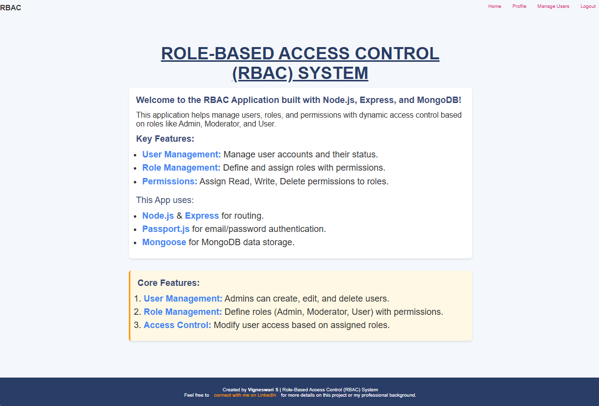
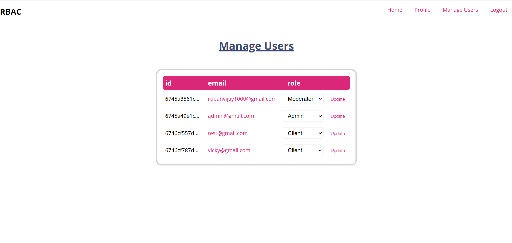
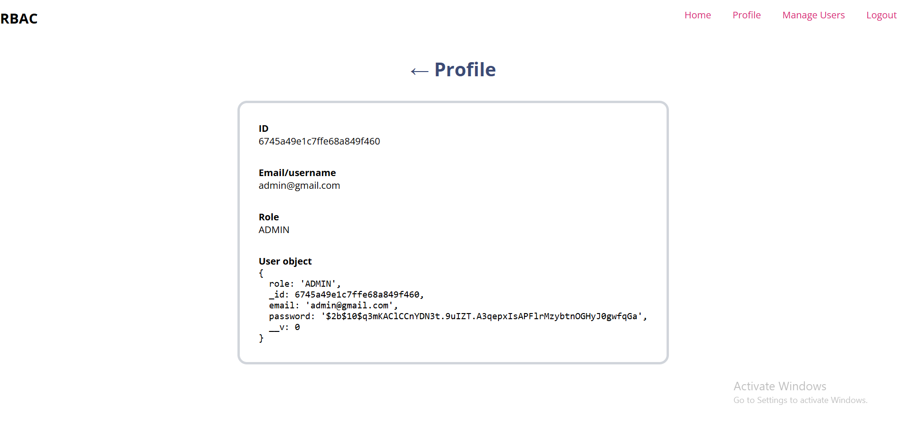

# Role Based Access Control 

# Description 

This project is a Role-Based Access Control (RBAC) System built with Node.js, Express, and MongoDB. It allows the management of users, roles, and permissions dynamically, enabling secure and structured access control for different user types, such as Admins, Moderators, and Client.

For authentication we have only Email & Password option but other authentication options using OAuth/OAuth2.0 like Google, Facebook, Apple, GitHub, etc, can be easily incorporated.

The application is based on the **MVC pattern** i.e. Model View Controller.

**Mongoose** is used as an ORM for MongoDB for storing Users in Database.

**Passport JS** is used for local(email, password) authentication.


---

## To start setting up the project

Step 1: Clone the repository

```bash
git clone https://github.com/Vigneswari1106/rbac-system.git
cd rbac-system
```

Step 2: Install dependencies:

```bash
npm install
```

Step 3: Create a .env file in the root directory with the following keys:

```bash
PORT=3000
MONGO_URI=mongodb://localhost:27017/your_db_name
SECRET_KEY=your_secret_key

```
Step 4: Start the server:

```bash
npm start
```

Step 5: Open your browser and navigate to:

```bash
http://localhost:3000
```

## Screenshots
## Dashboard


## Manage Users


## Profile


## License

This project is free to use and does not contain any licensing restrictions.

## Contact

Developer: Vigneswari S
LinkedIn: linkedin.com/in/vigneswari-s-090046330/
